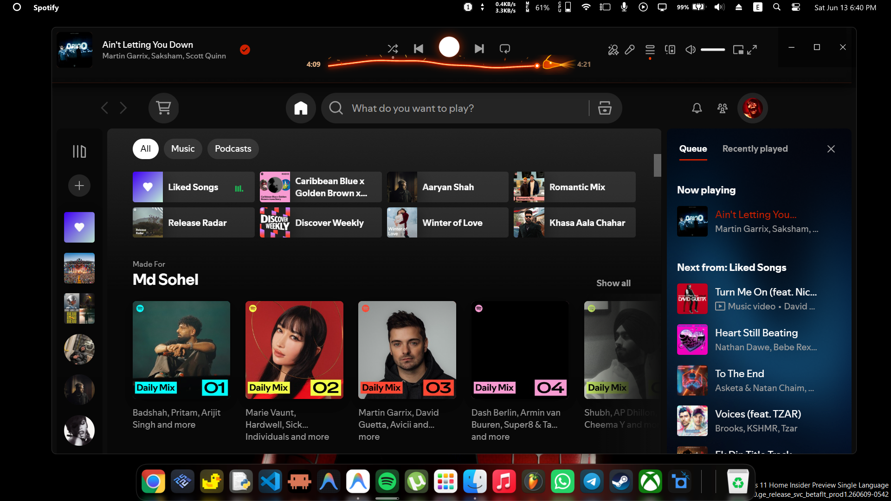
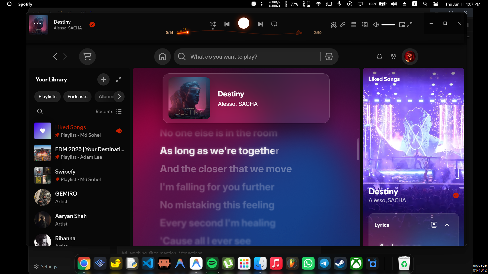
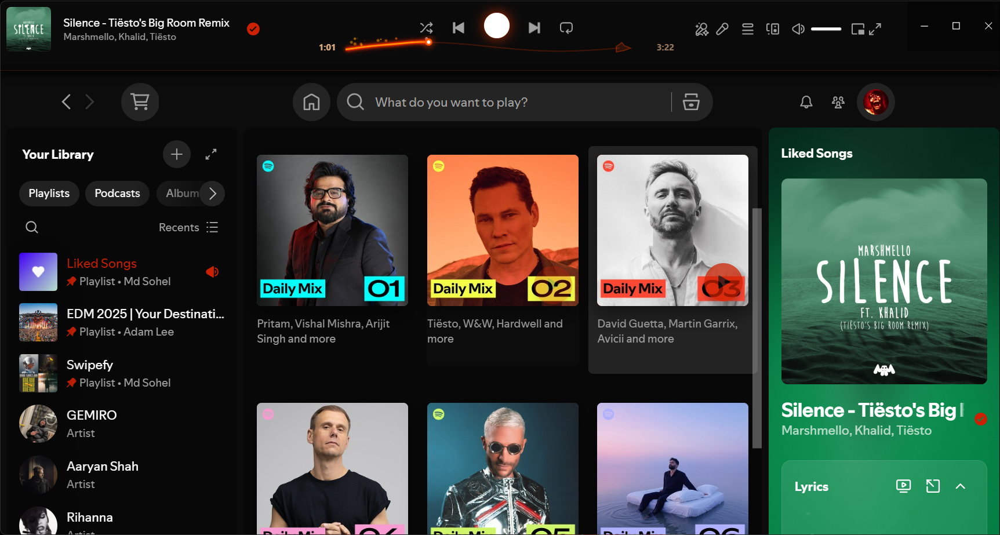

<div align="center">
  
  <h1>🔥 Ember</h1>
  
  A completely reimagined [Spicetify](https://github.com/spicetify/spicetify-cli) theme for Spotify featuring a **top-mounted player** and a custom **animated dragon seekbar**.

  [](https://spicetify.app)
  [](LICENSE)
  [](https://github.com/Expir3d/spotify-ember-theme)

  **⭐ Star this repo if you like it! Suggestions and feature requests are welcome.**
</div>

---

## 📸 Preview

<p align="center">
  
</p>

<p align="center">
  
  
</p>

---

## ⚡ Features

Unlike standard themes that only change colors, Ember physically restructures your Spotify layout:

| Feature | Description |
|---------|-------------|
| 🔝 **Top-Mounted Player** | The playback bar is moved to the very top, acting as a sleek, draggable window header |
| 🐉 **Dragon Seekbar** | A custom canvas seekbar with a bezier-curve serpent head, animated flame breath, a glowing eye, and a curved horn |
| 🔥 **Dual Particle System** | Fast-decelerating spark lines (70%) and slow, wobbling teardrop wisps (30%) rise from the played portion |
| 🌋 **4-Layer Glow** | The played seekbar body radiates through a wide heat haze, deep crimson, bright orange, and a hot white-gold center |
| 💫 **Pulsing Unplayed Line** | The unplayed portion subtly breathes with a sine-wave opacity pulse |
| 🖤 **True AMOLED Black** | `#080808` main backgrounds save energy on OLED screens and provide deep contrast |
| 🃏 **Interactive Hover States** | Smooth card lifts with ember shadows on every interactive element |

---

## 🛠️ Dependencies

- Latest version of [Spicetify CLI](https://spicetify.app/docs/getting-started)
- Latest version of the [Spotify Desktop Client](https://www.spotify.com/download)

---

## 📥 Installation

### 🛍️ Spicetify Marketplace (Recommended)
Simply install the [Spicetify Marketplace](https://github.com/spicetify/spicetify-marketplace). Once installed, open the Marketplace tab in Spotify, search for `Ember`, and click the install button!

### 💻 Manual Installation

<details>
  <summary>Click here for step-by-step manual installation instructions</summary>
  
  1. Find your Spicetify Themes folder:
     ```bash
     spicetify path userdata
     ```
  2. Navigate to the `Themes` folder inside that directory and create a new folder named `Ember`.
  3. Clone or download this repository, and copy all files (`color.ini`, `user.css`, `theme.js`, `manifest.json`) into the `Ember` folder:
     ```bash
     git clone https://github.com/Expir3d/spotify-ember-theme.git
     ```
  4. Apply the theme:
     ```bash
     spicetify config current_theme Ember
     spicetify config color_scheme Base
     spicetify config inject_theme_js 1
     spicetify apply
     ```
     > ⚠️ `inject_theme_js 1` is **required** for the Animated Dragon Seekbar to work!
</details>

---

## 🎨 Customization

Ember uses standard CSS variables. You can modify the base colors by editing the `color.ini` file in the theme directory.

```ini
[Base]
main               = 080808
sidebar            = 0C0C0C
player             = 0F0F0F
button             = FF3D00
```
*After saving changes, simply run `spicetify apply` again.*

---

## 📁 File Reference

| File | Purpose |
|------|---------|
| `color.ini` | Defines the color palette for Spicetify |
| `user.css` | All visual styling — top-player layout, AMOLED backgrounds, hover effects, scrollbars |
| `theme.js` | Animated dragon seekbar canvas, bezier serpent head, dual particle system, control routing |
| `manifest.json` | Marketplace metadata for automatic discovery |

---

## 🤝 Contributing

Contributions, issues, and feature requests are welcome!  
Feel free to check the [issues page](https://github.com/Expir3d/spotify-ember-theme/issues).

---

<div align="center">
  <p>Made with 🔥 for music that burns</p>
  <p>&copy; 2024 Ember Theme</p>
</div>
